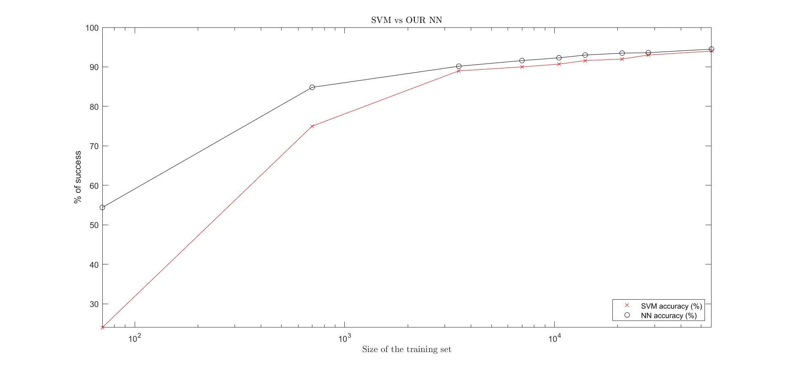

# First-Approach-to-the-design-of-a-Neural-Network
This repository presents the code and design of a fully connected neural network (NN) created from scratch, which bases its learning in the Stochastic Gradient Descent method (SGD). The net was designed to be selfconsistent, and it relies only in the libraries NumPy and random. The user can easily input the desired number of layers together with the number of neurons per layer, which can be different for each layer.

Moreover, the NN has been succesfully trained and used to predict handwritten digits from the MNIST dataset, and it could potentially be used for many other purposes only by changing the number of neurons in the first and last layers. (More details on the section "Comments on use")

Note that for more complex problems one should probably reconsider the architechture of the network and use a more sophisticated design such as a convolutional network, or even a combination of both a fully connected NN and a convolutional one.

## Convergence analysis
To ilustrate the functioning of the net, we present a comparaison of its accuracy vs the accuracy obtained with SVM, for different sizes of the training set. The NN performs much better than SVM when the size of the dataset is small.

## Comments on use
**A) Use the network and train it with MNIST:**

Download the two Python files that can be found inside the folder named "our_NN". The NN.py file contains all the functions required for the network to work, such as the SGD algorithm, the feedforward function, the cost functions, the routine in charge of backpropagation etc. The run.py file is the one to be executed. It calls the NN, initializes the weights and biases and starts the learing process. 

**B) Use the NN with a different dataset:**

If we want to use the NN to learn from a different dataset, we have to follow the next schematic steps:

i) Modify the run.py file to load the desired dataset.

ii) When calling the NN on the run.py file, remember that the number of neurons on the first and last layer of the NN must agree with the features of the training data. As an ilustrative example, to train the NN with the MNIST dataset we must keep in mind that the images have (28x28)=784 pixels, meaning that the first layer should have 784 neurons. Next, concerning the last layer, if we want to predict numbers from 0 to 9, it is a natural choice to set the number of neurons to be equal to 10, so that each neuron is associated with one possible output. 

🧠 Neural Network for Handwritten Digit Recognition
A custom implementation of a fully‑connected neural network trained on MNIST/EMNIST, including image preprocessing and a Tkinter drawing interface.

📌 Overview
This project implements a from‑scratch neural network in Python using only NumPy and standard libraries.
It includes:

A configurable feedforward neural network

Two training modes: quadratic loss and cross‑entropy loss

Manual stochastic gradient descent (SGD) with mini‑batches

Full backpropagation implementation

Image preprocessing pipeline for user‑provided images

A Tkinter GUI that allows drawing digits and visualizing prediction probabilities

Tools to save trained weights and biases

The goal is educational: understanding how neural networks work internally without relying on high‑level frameworks like PyTorch or TensorFlow.

🏗️ Network Architecture
The class Neural_Network receives a list describing the number of neurons per layer:

python
nn = Neural_Network([784, 64, 32, 10])
This creates:

Input layer: 784 neurons (28×28 pixels)

Hidden layers: 64 and 32 neurons

Output layer: 10 neurons (digits 0–9)

Weights are initialized using a Gaussian distribution scaled by

1
/
number of inputs
🚀 Training Methods
Two training functions are available:

1. SGD_quad — Quadratic Loss
Uses the classical quadratic cost

Backpropagation includes the derivative of the sigmoid

Suitable for experimentation and learning

2. SGD_entropy — Cross‑Entropy Loss
Uses cross‑entropy cost

Faster and more stable training

Includes L2 regularization via lambda_learn

Both methods:

Shuffle data using random mini‑batches

Update weights and biases after each batch

Optionally evaluate accuracy on test data

Save final weights to a .txt file

🔁 Feedforward & Backpropagation
Feedforward
Computes activations layer by layer

Uses the sigmoid activation function

Returns both activations and pre‑activation values

Backpropagation
Two versions:

backprop → quadratic loss

backprop_entropy → cross‑entropy loss

Both compute gradients for:

Weight matrices

Bias vectors

🔍 Prediction
The method:

python
predict, aL = self.prediction(image)
returns:

predict: the digit with highest activation

aL: the full 10‑dimensional output vector

🖼️ Image Preprocessing
The function preprocess_image handles:

Grayscale conversion

Normalization

Cropping based on pixel intensity changes

Resizing to 28×28

Scaling pixel values to [0,1]

Standardization using a fitted StandardScaler

This allows predicting digits from arbitrary user images.

🎨 Tkinter GUI for Drawing Digits
The project includes an interactive GUI:

Features:
A 280×280 black canvas to draw digits

Automatic prediction every 100 ms

A bar‑style visualization of the 10 output activations

A “Clear Canvas” button

Real‑time feedback

Key functions:
setup_gui() → builds the interface

paint() → handles drawing

predict_digit_popup() → updates predictions

preprocess_image_c() → prepares the drawn digit

📂 File Saving
After training, weights and biases are saved in human‑readable format using:

python
convert_and_write(file, "Weights", self.weights)
This avoids retraining every time.

📁 Project Structure (suggested)
Código
our_NN/
│── NN.py                # Main neural network implementation
│── run.py               # Script to train and test the network
│── fotos/               # User images for prediction
│── final_weights_*.txt  # Saved weights after training
│── README.md            # Project documentation
🧪 Requirements
Python 3

NumPy

Matplotlib

Pillow

Tkinter (included with most Python installations)

scikit‑learn

Install missing packages with:

bash
pip install numpy matplotlib pillow scikit-learn termcolor
🙌 Authors
Janot Vilaró

Alejandro Samaniego

